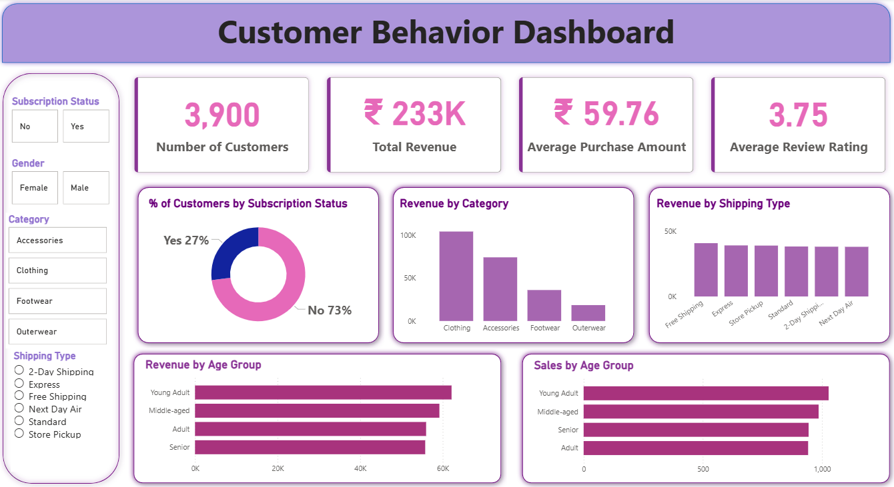

# Customer Shopping Analysis

## Overview

This project analyzes customer shopping behavior using Excel, SQL, Power BI, and Python. The analysis focuses on customer demographics, purchasing patterns, product categories, payment methods, shipping preferences, seasonal trends, and customer ratings. Interactive dashboards and exploratory data analysis were used to uncover actionable business insights.

## Tools Used

* Excel
* SQL (MySQL)
* Power BI
* Python
* Pandas
* NumPy
* Matplotlib
* Google Colab

## Dashboard Preview

## Analysis Performed

* Data Cleaning and Preparation
* Missing Value Analysis
* Customer Demographics Analysis
* Revenue Analysis by Category
* Gender-Based Purchase Analysis
* Seasonal Sales Analysis
* Product Size Distribution Analysis
* Purchase Frequency Analysis
* Customer Rating Analysis
* Shipping Type Analysis
* Subscription Status Analysis
* Payment Method Analysis

## Dashboard Features

* KPI Tracking
* Interactive Slicers
* Revenue Breakdown
* Category Performance Analysis
* Gender-Based Sales Analysis
* Seasonal Trend Analysis
* Customer Segmentation
* Purchase Frequency Insights

## Python Analysis

The dataset was further analyzed using Python libraries:

* Data exploration using Pandas
* Statistical calculations using NumPy
* Missing value treatment
* GroupBy analysis
* Data visualization using Matplotlib
* Business insight generation

## Key Insights

* Clothing generated the highest revenue among all product categories.
* Male customers contributed a larger share of total sales.
* Medium-sized products accounted for the highest proportion of orders.
* Seasonal purchasing patterns revealed fluctuations in customer spending.
* Adults and senior customers represented the largest customer segments.
* Purchase frequency analysis highlighted recurring customer behavior.

## Files

* Customer_Shopping_Analysis.xlsx
* Customer_Shopping_Analysis.sql
* customer_behavior_dashboard.pbix
* Customer_Shopping_Analysis.ipynb
* raw data.csv
* customer_shopping_dashboard.png

## Author

**Ronil Kothari**
